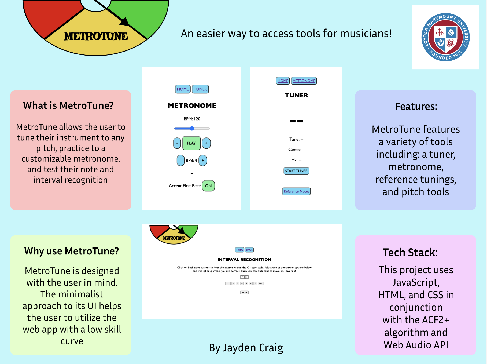

# MetroTune

MetroTune is a new way to access tools for learning an instrument - particularly guitar. This web app will provide you with an all in one place to learn the basics of music. The tuner tool will allow users to precisely tune their instrument to whatever frequency they prefer. The metronome will allow musicians to be able to practice their tempo. Enjoy learning!

[Click Here!](https://jcraig3.github.io/metrotune/code/home.html)

